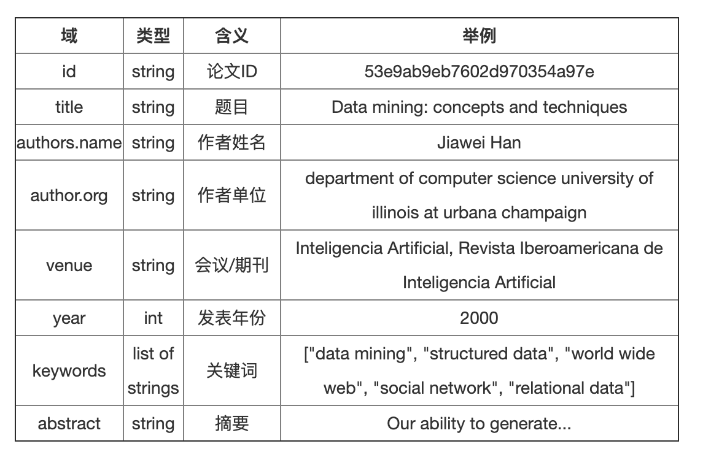

# 论文的冷启动消歧 

#### 任务描述 
- 给定一堆拥有同名作者的论文，要求返回一组论文聚类，使得一个聚类内部的论文都是一个人的，不同聚类间的论文不属于一个人。最终目的是识别出那些同名作者的论文属于同一个人。

#### 参考方法
- 解决这一问题的常用思路就是通过聚类算法， 提取论文特征，定义聚类相似度量，从而将一堆论文聚成的几类论文，使得聚类内部论文尽可能相似，而类间论文有较大不同，最终可以将每一类论文看成属于同一个人的论文。 
- 原子聚类的思想，大致思路是首先用较强的规则进行聚类，例如：两篇论文如果有两个以上的共同作者，那么这两篇论文属于同一类，这样可以保证聚类内部的准确率，随后用弱规则将先前的聚类合并，从而提高召回率。
- 有些工作考虑了传统特征的局限性，所以利用低维语义空间的向量表示方法，通过将论文映射成低维空间的向量表示，从而基于向量使用聚类方法。 

#### 数据说明

##### 训练集
###### train_author.json  
- 数据格式：此文件中的数据组织成一个字典（dictionary, 记为dic1）,存储为JSON对象。 dic1的key是作者姓名。 dic1的value是表示同名作者集合的字典（记为dic2）。
- dic2的key是作者ID，dic2的value是该作者的论文ID列表。 
###### train_pub.json 
- 此文件包含train_author.json所有论文的元数据，数据存储为JSON对象。
- 数据格式：此文件的数据表示为一个字典（dictionary），其key是论文ID，其value是相应的论文信息。每篇论文的数据格式如下：

##### 验证集
###### sna_valid_author_raw.json 
- 二级字典，key值为作者姓名，value为一个论文的list，代表该作者姓名下所有同名作者的论文，需要将同名作者论文聚成不同的类簇。

###### sna_valid_example_evaluation_scratch.json
- 示例提交文件，组织成二级字典格式，key值为作者姓名，value值是一个二维列表，第一维的长度代表类簇的数目，第二维代表各个类簇的论文ids 

###### sna_valid_pub.json 
- 二级字典，代表验证集所有论文的元信息，格式同tran_pub.json  

#### code说明 
- test_1 : 对数据的数据分析和数据与处理， 验证不同的特征提取和规则进行聚类。 
- test_2 : 复现第一名的实验实现 。

#### 参考资料
- [TD-IDF参考的code](https://www.biendata.xyz/models/category/3000/L_notebook/ "悬停显示")
- [基于网络嵌入和语义表征的作者名消歧](https://www.biendata.xyz/models/category/3968/L_notebook/ "悬停显示")
